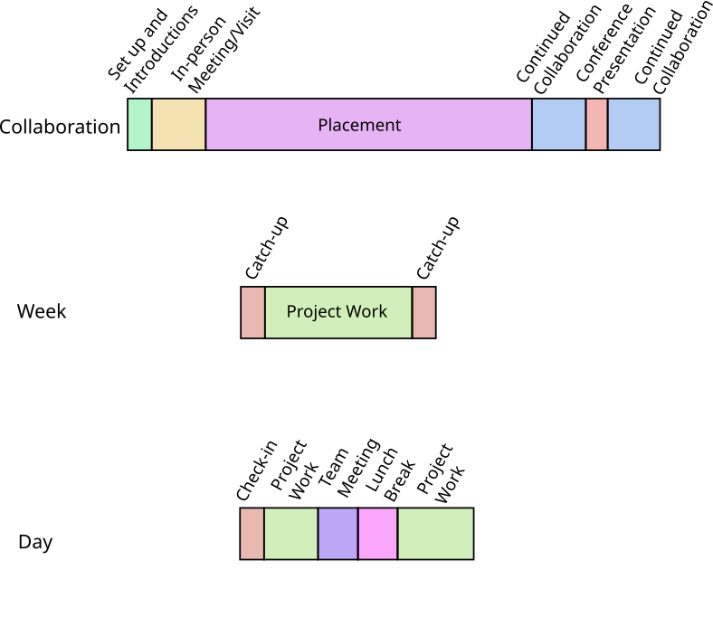

# Virtual Placements

## Why Virtual Placements?

A placement is a great opportunity for researchers and RTPs to learn from each other and establish collaborations. 
However, not everyone can commit to working from a different place for an extended amount of time. Family commitments, 
physical or mental health or disability issues, financial considerations or other reasons can mean that someone misses out on 
this opportunity. 

Virtual placements - while not offering the same complete absorption as an in-person placement - offer a good alternative. In order
for them to be successful, conscious effort has to be made by the host as well as the (virtual) visitor to give them the same
priority as an in-person visit.

## Example Timeline

The above image shows some example timelines for a virtual placement. Before the placement, some time should be spend to discuss the project
to be worked on, and general working arrangements. It is also useful to already make introductions to the team, and ideally a "buddy" is assigned, i.e., a
person that the intern can turn to with general questions, and who is checking in for a coffee chat every now and then during the placement.

If possible, it can be  very helpful if the intern visits the project team for a day or two, to establish relationships and see how everyone is working. If that is not
possible, a virtual "shadowing" day can be arranged, where the intern joins one of the team members in their meetings. 

During the placement, a week is started with a catch-up meeting in which the plans for the week are discussed. At the end of the week, a retrospective
meeting looks back at the week and discusses achievements and challenges.

Each day should have a check-in with the intern, either by the same person (the host), or by a rota of team members. The intern should join team and project
meetings where appropriate, and ideally some social meet-ups over coffee, lunch seminars, etc. should be arranged.

The collaboration should not end on the last day of the placement, but continue beyond. It is nice if the hosting team and the intern can meet again at
conferences or other events, and ideally prepare a presentation or publication together, or continue to maintain a joined code base.
