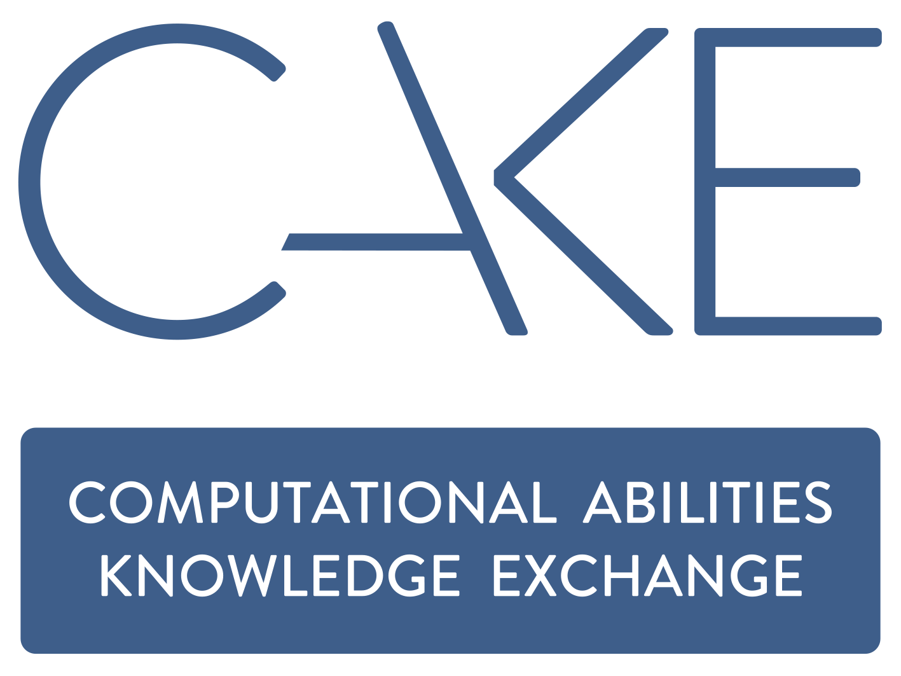

---
title:
tags: 
---

#
Welcome to CAKEbox!

  

The knowledge hub for the **Computational Abilities Knowledge Exchange (CAKE)** :cake: Project!

This is a central place for the UK Digital Research Infrastructure (DRI) community to exchange knowledge, share best practices and reuse templates. 

Browse around, explore content [tags](tags.md) or use the search box to quickly find what you need! 

See something missing? Want to share your own resources? [Please contribute](https://github.com/CAKE-DRI/CAKEbox) — your input helps grow the CAKE community. 

## What you can find here: 
  - :hammer_and_pick: [How To Guides](how-to/index.md) - curated advice, tips and best practices draw from real-world experiences across the community. 
  - :page_facing_up: [Examples and Templates](examples-and-templates/index.md) - reusable examples to help you get started without staring at a blank page. 
  - :handshake: [KE Working Groups](working-groups/index.md) - collaborate with the community and help to shape knowledge exhange across the CAKE network. 

## Code of Conduct 
By using this site, you are agreeing to abide by the [CAKE Code of Conduct](code-of-conduct.md), which outlines our commitment to respectful, inclusive, and constructive collaboration.

<!-- ## Commands
* `mkdocs new [dir-name]` - Create a new project.
* `mkdocs serve` - Start the live-reloading docs server.
* `mkdocs build` - Build the documentation site.
* `mkdocs -h` - Print help message and exit. 
For full documentation visit [mkdocs.org](https://www.mkdocs.org). -->

<!-- EDI working group 
- Terms of reference 
- Storing the minutes 
- List of requests for help/guidance from the community/members of the group 
Resources: 
- How to run recruitment inclusive and other considerations 
- How to onboard 
- How to run inclusive events and training 
- How to do training
- How to have an inclusive working environment 
- How to improve EDI more generally across the community 
How to set up a working group
How to write a code of conduct 
How to write a terms of reference 
How to be a good reviewer 
Terms of reference for reviewers 
How to mentoring programme 
How to have a successful placement or visit 
How to run an inclusive review process 
How to write a proposal for funding or for conferences  -->