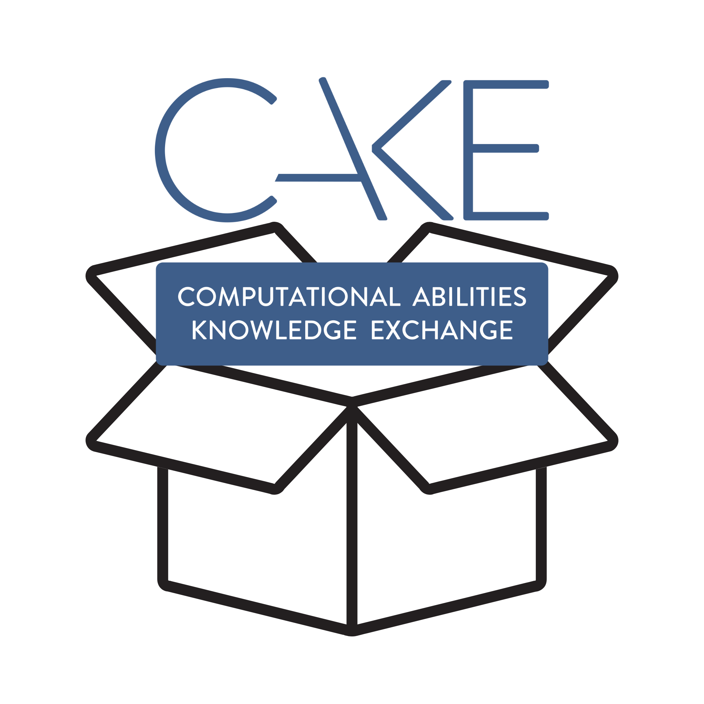

  

<h1 align="center">Welcome to CAKEbox 🍰📦</h1>

  A community knowledge hub for the UK Digital Research Infrastructure (DRI) community

---

## What is CAKEbox? 

CAKEbox is a shared space for practical knowledge from across the UK DRI community.

Here you’ll find:

- Guidance and how-tos  
- Templates and reusable materials  
- Real examples from the community  
- Lessons learned and best practice  
- Useful external resources  

---

## Explore 

Browse by theme to find resources, tools, and community contributions.

!!! question "Don't know where to start?"
    We recommend **[Sprinkles of Knowledge](community-tips/index.md)**, where you can find quick tips, advice, and experiences from our community 🧁

<!-- material/tags {include: [Central themes]} -->

--- 

## Other Hubs

- [Software Sustainability Institute Resources Hub](https://www.software.ac.uk/resource-hub)
    - Including information ranging from software project management and sustainability to event organisation and online training delivery.
- [Society of Research Software Engineering Resources](https://society-rse.org/resources/)
    - Ranging from EDIA to remote working to reproducible research     

---

## Contributing

CAKEbox is built by the community, for the community. Share what you know! 

👉 **[Learn how to contribute](how-to-contribute/index.md)**

Choose how you’d like to contribute:

1. I have a quick idea or tip to share
2. I've found a useful resource
3. I want to write something new 

---

## Code of Conduct 
By using this site, you are agreeing to abide by the **[CAKE Code of Conduct](code-of-conduct.md)**, which outlines our commitment to respectful, inclusive, and constructive collaboration.

